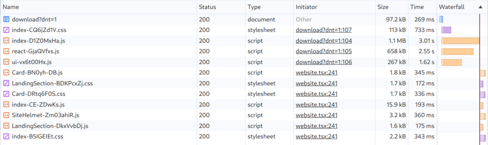
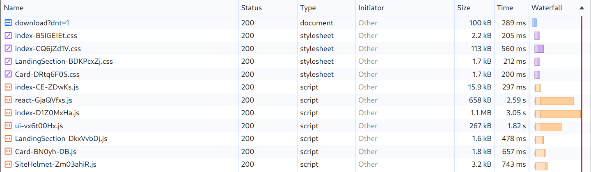

[](https://www.npmjs.com/package/vite-preload)

# vite-preload

This plugin will significantly speed up your server rendered Vite application by preloading dynamically imported React components and their stylesheets as early as possible. It will also ensure that the stylesheet of the lazy component is included in the initial HTML to avoid a Flash Of Unstyled Content (FOUC).

This plugin is different to [vite-plugin-preload](https://www.npmjs.com/package/vite-plugin-preload) because it evaluates used modules at render time rather than including every single module in the HTML at build time.  

Includes functionality similar to [loadable-components](https://loadable-components.com/) where you can create `<link>` tags and `Link` headers for the rendered chunks.

#### See [`./playground`](./playground/) for a basic setup with preloading

## Explainer

Any lazy imported React component and its CSS will only be loaded once the parent module has been loaded and executed. This will lead to a Flash Of Unstyled Content (FOUC) and a delay in loading the required chunks for the React client.

This plugin will collect which modules are rendered on the server and help you inject `<link>` tags in the HTML `<head>` and `Link` preload headers for which you can use with  [103 Early Hints](https://developer.mozilla.org/en-US/docs/Web/HTTP/Status/103) which you can use to make the browser work before React even started rendering on the server.

## Without preloading

You can see the async chunks being loaded after the JS started executing (indicated by the red line)


## With preloading

You can see that the async chunks are loaded directly and instantly available once the JS starts executing


## Installation

```
$ npm install vite-preload
```

### `vite.config.ts`

Setup the Vite plugin to inject a helper function in your dynamically imported React components that will make lazy components detected on SSR.


```ts
import preloadPlugin from 'vite-preload/plugin';
export default defineConfig({
    plugins: [
        preloadPlugin(),
        react(),
        // ...
    ],
});
```


> [!IMPORTANT]
> Preloading does not show up in development mode. In development mode, Vite will inject CSS using inline style tags on demand, which will always come with some Flash Of Unstyled Content (FOUC). I tried hard but I couldn't find a way to extract the style tags to inline it dev mode to avoid the flash and have a reliable server render testing experience

---

### Setup on the server in your render handler

```tsx
import { ChunkCollectorContext, preloadAll } from 'vite-preload';

async function handler(req, res) {
    // Preload all async chunks on the server otherwise the first render will trigger the suspense fallback because the lazy import has not been resolved
    await preloadAll();

    const collector = createChunkCollector({
        manifest: './dist/client/.vite/manifest.json',
        entry: 'index.html',
    })

    const template = process.env.NODE_ENV === 'production' ? await fs.readFile('./dist/client/index.html', 'utf8') : undefined;
    const [head, tail] = template.split('<!-- app-root -->')

    // Write a HTTP 103 Early Hint way before React even started rendering with the entry chunks which we know we will be needed by the client.
    // Chrome will only pick it up when running with HTTP/2 so try Firefox if you want to test it.
    res.writeEarlyHints({
        link: collector.getLinkHeaders()
    })

    const { pipe } = renderToPipeableNodeStream(
        <ChunkCollectorContext collector={collector}>
            <App />
        </ChunkCollectorContext>,
        {
            // onShellReady also works but it will miss chunks that React does not consider a part of the shell, like server components or lazy components on the server that has not resolved. React will always suspend and show the fallback ui for lazy components on the first server render unless you preload all lazy components using something like react-lazy-with-preload first.
            onAllReady() {
                const linkTags = collector.getTags();
                const linkHeaders = collector.getLinkHeaders();

                // The link header below now contains 
                res.writeHead(200, {
                    'content-type': 'text/html',
                    'link': linkHeaders
                })

                // Inject <link rel=modulepreload> and <link rel=stylesheet> in the head. Without this the CSS for any lazy component would be loaded after the app has and cause a Flash of Unstyled Content (FOUC).
                res.write(head.replace('</head>', `${linkTags}\n</head>`););

                const transformStream = new Transform({
                    transform(chunk, encoding, callback) {
                        res.write(chunk, encoding);
                        callback();
                    },
                });

                pipe(transformStream)

                transformStream.on('finish', () => {
                    res.end(tail);
                });
            }
        }
    );
}
```

## Options

`createChunkCollector(options)`
- `manifest`: string/object - path to the vite manifest or the manifest object (defaults to `./dist/client/.vite/manifest.json`)
- `entry`: string - entry name, defaults to `index.html`
- `preloadFonts`: true/false - Include fonts, true by default
- `preloadAssets`: true/false - Include assets like images and fonts

`ChunkCollector`
- `getTags()`: Returns a string with `<link>` tags to be included in the HTML head
- `getLinkHeaders()`: Returns a list with `Link` header values

## Migrating from `loadable-components`

Replace all 

```tsx
import loadable from '@loadable/component'
loadable(() => import('./module'))
```
with
```tsx
import { lazy } from 'vite-preload'
lazy(() => import('./module'))
```
and evaluate if it performs well enough for your use case.

Look into the examples below for other ways to optimize your app.

## Usage with `React.lazy`

React.lazy works with Server Rendering using the React Streaming APIs like [renderToPipeableStream](https://react.dev/reference/react-dom/server/renderToPipeableStream)

vite-preload exports a `React.lazy` wrapper that supports preloading using `Component.preload()` and `preloadAll()`

```tsx
import { Suspense } from 'react';
import { lazy, preloadAll } from 'vite-preload';

const Card = lazy(() => import('./Card'));

function App() {
    return (
        <div>
            <Suspense fallback={<p>Suspending...</p>}>
                <Card />
            </Suspense>
        </div>
    )
}
```

### Server 

> [!NOTE]
> React.lazy has some undeterministic behaviour in server rendering.
>
> - The first render on the server will always trigger the suspense fallback. Use `await preloadAll()` on the server to preload all async components before rendering the app.
> - Larger components in large projects that takes time to load will trigger the suspense fallback on the client side, even if the component is server rendered. This might be avoided by preloading all async routes before hydration with `await preloadAll()` or skipping the top level Suspense boundary.


## Usage with `react-router`

React Router v6 supports lazy routes using the `lazy` prop on the `Route` component.

When navigating on the client side to a lazy route, the document will not repaint until the lazy route has been loaded, avoiding a flash of white like when using loadable-components with react-router. This might have a negative impact on your [INP](https://web.dev/articles/inp) metric, so you might want to use deterministic loading of lazy routes like preloading the next step in the user flow or preloading them all in the background after the primary modules has been loaded.

> [!NOTE]
> When hydrating a lazy route, the server rendered HTML will be thrown away, cause a hydration mismatch error, then load and render again.
> To prevent this so you will need preload all the lazy routes rendered by the server like in the example below.
> See https://reactrouter.com/en/main/guides/ssr#lazy-routes

```tsx
import { Route } from 'react-router'
import { hydrateRoot } from 'react-dom/server'

function lazyRoute(dynamicImportFn: () => Promise<any>) {
  return async () => {
    const { default: Component } = await dynamicImportFn()
    return { Component }
  }
}

const routes = (
    <Route lazy={lazyRoute(() => import('./Card'))} />
)

function loadLazyRoutes() {
    const matches = matchRoutes(routes, window.location);

    if (!matches) {
        return
    }

    const promises = matches.map(match => {
        if (!m.route.lazy) {
            return
        }
        const routeModule = await m.route.lazy!()

        m.route.Component = routeModule.Component
        delete m.route.lazy
        Object.assign(m.route, {
            ...routeModule,
            lazy: undefined,
        })
    });

    await Promise.all(promises)
}

async function main() {
    await loadLazyRoutes()

    ReactDOM.hydrateRoot(
        <RouterProvider router={router} />,
        document.getElementById('root')
    )
}
```

# How it works

## Plugin
The plugin will inject a hook in every dynamically imported React component. This is because we need to map the module id to the corresponding client chunks from the generated Vite [manifest.json](https://vitejs.dev/guide/backend-integration).


Below is what the plugin would inject in a module imported  using `React.lazy(() => import('./lazy-component'))`:
```ts
// src/lazy-component.tsx
import { __collectModule } from 'vite-preload/__internal';
import styles from './lazy-component.module.css';
export default function Lazy() {
    __collectModule('src/lazy-component.ts'); // Injected by the plugin
    return <div className={styles.div}>Hi</div>
}
```

The manifest entry for this chunk would look similar to

```json
"src/lazy-component.tsx": {
    "file": "assets/lazy-component-CbXeDPe5.js",
    "name": "lazy-component",
    "src": "src/lazy-component.tsx",
    "isDynamicEntry": true,
    "imports": [
        "_vendor-1b2b3c4d.js",
    ],
    "css": [
        "assets/lazy-component-DHcjhLCQ.css"
    ]
}
```


## Server
The React server uses the context provider to catch these hook calls and map them to the corresponding client chunks extracted from the manifest

```tsx
import { ChunkCollectorContext, preloadAll } from 'vite-preload';

const collector = createChunkCollector({
    manifest: './dist/client/.vite/manifest.json',
    entry: 'index.html',
});

// Preload all async components before rendering the app to avoid the first render to trigger the suspense fallback
await preloadAll();

renderToPipeableNodeStream(
    <ChunkCollectorContext collector={collector}>
        <App />
    </ChunkCollectorContext>,
    {
        onAllReady() {
            collector.getChunks()
            // app.94184122.js
            // app.94184122.css
            // lazy-module.94184122.js
            // lazy-module.94184122.css
        }
    }
)
```


## Example HTTP response

1. The 103 Early Hint will preload the entry chunks because they are known to be needed by the client. It's sent before React starts doing anything.
2. The 200 OK response headers also contains the chunks of the lazy JS and CSS that were rendered.
3. The head of the document uses the stylesheets, executes the primary module, and leaves the async modules as preloads for the browser to instantly use when a dynamic import is used.

```html
HTTP/2 103
link: </assets/index-CG7aErjv.js>; rel=modulepreload; crossorigin
link: </assets/index-Be6T33si.css>; rel=preload; as=style; crossorigin

HTTP/2 200
content-type: text/html; charset=utf-8
link: </assets/index-CG7aErjv.js>; rel=preload; as=module; crossorigin
link: </assets/index-Be6T33si.css>; rel=preload; as=style; crossorigin
link: </assets/Card.tsx>; rel=modulepreload; crossorigin
link: </assets/Card.css>; rel=preload; as=style; crossorigin

<html>
    <head>
        ...
        <script type="module" crossorigin src="/assets/index-CG7aErjv.js"></script>
        <link rel=modulepreload href="/assets/Card.tsx" crossorigin>
        <link rel="stylesheet" crossorigin href="/assets/index-Be6T33si.css">
        <link rel=stylesheet href="/assets/Card.css" crossorigin>
        ...
    </head>
    <body>
        ...
    </body>
</html>
```

### Read more in the Vite documentation

- [Backend Integration](https://vitejs.dev/guide/backend-integration.html)
- [Server Side Rendering](https://vitejs.dev/guide/ssr.html)
